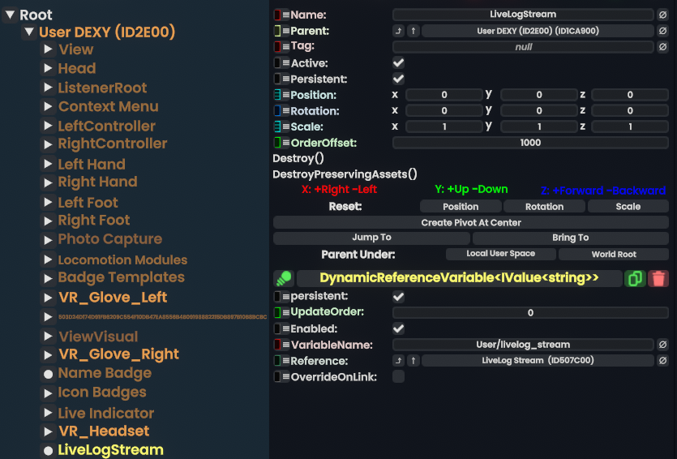

# LiveLogStream

A [ResoniteModLoader](https://github.com/resonite-modding-group/ResoniteModLoader) mod for [Resonite](https://resonite.com/).


## Installation

1. Install the [ResoniteModLoader](https://github.com/resonite-modding-group/ResoniteModLoader).
2. Place the [LiveLogStream.dll](https://github.com/Dexy/LiveLogStream/releases/latest/download/LiveLogStream.dll) into your `rml_mods` folder. This folder should be located at `C:\Program Files (x86)\Steam\steamapps\common\Resonite\rml_mods` for a standard installation. You can create it if it's missing, or if you start the game once with the ResoniteModLoader installed it will create this folder for you.
3. Launch the game. If you want to check that the mod is working you can check your Resonite logs.


### Slot Structure

```
UserRoot
└── LiveLogStream
    └── <DynamicReferenceVariable<IValue<string>>
        |   VariableName: User/livelog_stream
        └── Reference: <ValueStream<string>>
```


### Accessing the Log Stream

```
LiveLog
├── DynamicReferenceVariableDriver<IValue<string>>
|   ├── VariableName: "User/livelog_stream"
|   └── Target: → ValueSource on ValueDriver^1 on LiveLog
└── ValueDriver<string>
    └── ValueSource: → LiveLog Stream (ValueStream)
```
